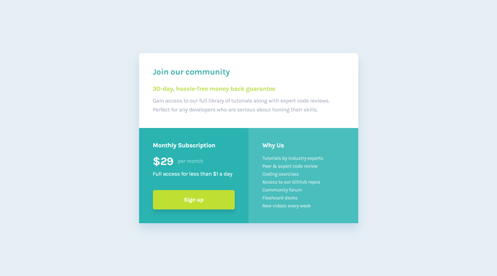

# Frontend Mentor - Single price grid component solution

This is a solution to the [Single price grid component challenge on Frontend Mentor](https://www.frontendmentor.io/challenges/single-price-grid-component-5ce41129d0ff452fec5abbbc). Frontend Mentor challenges help you improve your coding skills by building realistic projects.

## Table of contents

- [Overview](#overview)
  - [The challenge](#the-challenge)
  - [Screenshot](#screenshot)
  - [Links](#links)
- [My process](#my-process)
  - [Built with](#built-with)
  - [What I learned](#what-i-learned)
- [Author](#author)

## Overview

### The challenge

Users should be able to:

- View the optimal layout for the component depending on their device's screen size
- See a hover state on desktop for the Sign Up call-to-action

### Screenshot

<!--  -->
<!--  -->

### Links

<!-- - Solution URL: (https://www.frontendmentor.io/solutions/social-proof-section-with-not-css-selector-css-custom-vars-Gq4f84-af) -->
<!-- - Live Site URL: (https://lm-social-proof-section.netlify.app/) -->

## My process

### Built with

- Semantic HTML5 markup
- CSS custom properties/vars
- CSS grid
- Desktop-first workflow

### What I learned

Have not completed.

## Author

- Website - [Leon Michalak](https://www.leonmichalak.tech)
- Frontend Mentor - [@NinjaInShade](https://www.frontendmentor.io/profile/NinjaInShade)
- Instagram - [@lmdeveloper](https://www.instagram.com/lmdeveloper/)
